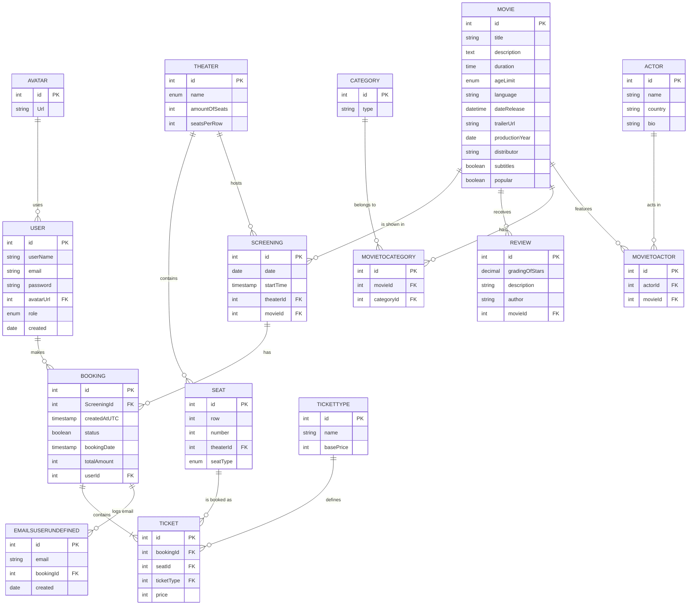

# 🎬 Movie-Maker (ShowTime Bio)
Repo : 
**Group E:**
* [Jarl (@webcrunch)](https://github.com/webcrunch)
* [Edvin (@Grevendev)](https://github.com/Grevendev)
* [Kifle (@KHS1993)](https://github.com/KHS1993)
* [Cecilia (@ceccav)](https://github.com/ceccav)
* [Zhaneta (@Zhaneta-Lecini)](https://github.com/Zhaneta-Lecini)

Ett komplett och modernt bokningssystem för en biograf. Projektet hanterar allt från dynamisk schemaläggning av filmer och sätesbokning, till AI-drivna filmtips och automatiska e-postbekräftelser.

---

## ✨ Nyckelfunktioner (Features)

* **Dynamiskt Bioprogram:** Frontend som hämtar och filtrerar aktuella visningar blixtsnabbt (utan caching-spöken!).
* **Evighetsmaskinen (Auto-Scheduling):** Databasen är självkörande. Ett SQL-event körs varje natt kl. 03:00 och kopierar förra veckans schema till nästa vecka, med inbyggt skydd mot krockar (`Filmlängd + 30 minuter städning`).
* **Sätesbokning & Bekräftelser:** Visuellt gränssnitt för att boka platser. Bekräftelsemail skickas automatiskt ut via **Mailpit** (lokal SMTP-server).
* **AI-Assistent:** Integrerad AI-chatt som hjälper besökare att hitta rätt film.

---

## 🛠️ Tech Stack

* **Frontend:** React, TypeScript, TailwindCSS, Vite
* **Backend:** C# .NET Minimal API
* **Databas:** MySQL 
* **Verktyg:** Docker, Mailpit, GitHub Actions (CI/CD)

---

## 📋 Förberedelser (Prerequisites)

För att köra detta projekt lokalt behöver du ha följande installerat:
* [Node.js](https://nodejs.org/) (v18+)
* [.NET 1o SDK](https://dotnet.microsoft.com/)
* [MySQL](https://www.mysql.com/) eller [Docker Desktop](https://www.docker.com/) (rekommenderas)

---

## 🚀 Kom igång lokalt (Utan Docker)

Om du vill köra alla delar separat på din maskin:

### 1. Databasen 
1. Skapa en lokal MySQL-databas.
2. Importera dump-filen: `mysql -u root -p din_databas < setup.sql`
3. **Viktigt:** Se till att event scheduler är igång i din databas för att auto-schemaläggningen ska fungera:
   ```sql
   SET GLOBAL event_scheduler = ON;

   2. Mailpit (E-post)
Ladda ner och starta Mailpit. Den kommer att lyssna på port 1025 för inkommande mail och visa en webbinkorg på http://localhost:8025.

3. Backend (C#)
Gå till backend-mappen: cd backend

Skapa/kopiera filen db-config.json och fyll i dina lokala databasuppgifter.

Starta servern:

Bash
dotnet run
4. Frontend (React)
Gå till frontend-mappen: cd frontend

Installera beroenden: npm install

Starta utvecklingsservern:

Bash
npm run dev
🐳 Kom igång med Docker (Enklaste vägen)
För en blixtsnabb setup med databas och Mailpit färdigkonfigurerat:

Se till att Docker är igång.

I projektets rotmapp, kör:

Bash
docker-compose up -d
Detta startar:

MySQL-databasen på port 3306.

Mailpit (Webb-UI på localhost:8025, SMTP på 1025).

Starta sedan Frontend och Backend manuellt enligt instruktionerna ovan (eller via Docker om ni har byggt containers för dem också!).

## 📊 Databasmodell (ER-diagram)

Vår databas är en normaliserad relationsdatabas, designad för att vara både robust och skalbar. Modellen nedan illustrerar hur kärnentiteterna i vårt system – såsom filmer, salonger, dynamiska filmvisningar, recensioner och detaljerade stolbokningar – är sammankopplade via tydliga relationer och kopplingstabeller.




## 🚀 CI/CD & Security
Vår pipeline är designad för säker och smidig continuous delivery till vår live-server:
* **GitHub Actions:** Hanterar automatisk deployment av applikationen till produktionsmiljön när ny kod slås ihop med `main`-branchen.
* **HashiCorp Vault:** Istället för att förlita oss på standardlösningar hanterar vi våra databas-strängar och API-nycklar (secrets) via HashiCorp Vault. Detta säkerställer en enterprise-klassad säkerhet under hela deployment-processen och innebär att inga känsliga uppgifter någonsin exponeras.

🧠 Arkitektur & Smarta Lösningar
Varför krockar aldrig våra filmer?
Systemet använder ett noga uträknat SQL-event. Istället för att manuellt lägga in filmer, har vi en "Golden Week" inskriven i databasen. Eventet använder en WHERE NOT EXISTS-koll samt kontrollerar tiden med logiken (startTime + duration + 30 minuter buffer) för att säkerställa att personalen hinner städa salongen innan nästa film börjar!

